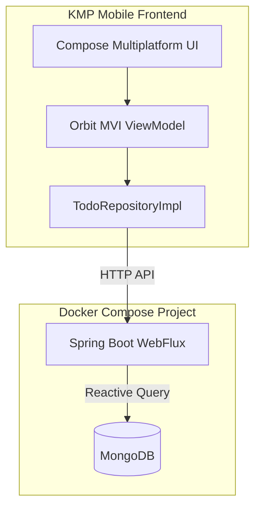

# 📅 TaskFlow (KMP TODO App)

🚀 **Purpose**

The goal of this system is to build a modern, cross-platform task management application with a secure offline-first client architecture and a highly performant, reactive backend. 

The application leverages Kotlin Multiplatform (KMP) to share code across Android and iOS platforms, while Spring Boot WebFlux and MongoDB provide a robust, non-blocking service layer to support real-time data sync.

---

## 🧩 Problem Statement

Building collaborative, cross-platform productivity tools typically requires duplicating business logic across different mobile operating systems (iOS and Android), which leads to:
* Desynchronized offline caching behavior
* Inconsistent request/response handling
* High maintenance overhead

Additionally, traditional blocking backend services face performance bottlenecks when scaling to support reactive data streaming and real-time push updates.

**✅ This project solves that by:**
* Utilizing **Kotlin Multiplatform (KMP)** to share 90%+ of the core logic, networking layers, viewmodels, and validation logic between Android and iOS.
* Structuring client logic with the **Orbit MVI** design pattern, ensuring a unidirectional, predictable flow of state and side effects.
* Powering the backend with **Spring Boot WebFlux** and reactive **MongoDB streams** for low-overhead, non-blocking data operations.

---

## ⚙️ Core Technologies

* **KMP (Kotlin Multiplatform)**: Shared Android/iOS business and UI layer
* **Spring Boot (WebFlux / Kotlin)**: Reactive API service
* **MongoDB**: NoSQL database for reactive storage
* **Docker**: Local containerization of databases and application infrastructure

---

## 🏗️ Architecture Diagram



---

## 🔧 Data Generation & Service Mocking

The backend application contains initialization logic to mock development data and simulate key operational tasks automatically.

### 🎯 Purpose
* **Initialize catalogs**: Populates MongoDB tables with standard task templates and default user categories.
* **Demonstrate Access Patterns**: Models relational queries over NoSQL collections using indexed references.
* **Operational Simulation**: Automatically handles account creation, state triggers, and password reset codes.

### ⭐ Key Features
* **Priority-Based Task Management**: Organizes items into `LOW`, `MEDIUM`, and `HIGH` designations with associated sorting ranks.
* **Multi-Format Date Tracking**: Configures due dates, creation timestamps, and updates in ISO UTC formats.
* **Reactive Data Broadcast**: Propagates data mutations reactively via Spring Event pipelines.

---

## 🔌 API Contract (High-Level)

### Authentication Endpoints
* `POST /api/v1/auth/register` - Creates a new user profile
* `POST /api/v1/auth/login` - Authenticates user credentials and returns a JWT token
* `GET /api/v1/auth/verify` - Confirms if the current session JWT is valid
* `GET /api/v1/auth/profile` - Retrieves authenticated user details
* `POST /api/v1/auth/forgot-password` - Requests an OTP reset code via email
* `POST /api/v1/auth/verify-reset-code` - Validates the received reset OTP
* `POST /api/v1/auth/reset-password` - Resets the password using a verified token
* `POST /api/v1/auth/verify-email` - Verifies a user's email verification code
* `POST /api/v1/auth/resend-verification-code` - Requests a new email verification code

### Todo Endpoints
* `GET /api/v1/todos` - Lists todos (supports optional `from`, `to` timestamps, and `category` filters)
* `GET /api/v1/todos/{id}` - Retrieves a single todo's properties
* `POST /api/v1/todos` - Creates a new todo item
* `PUT /api/v1/todos/{id}` - Updates a todo's titles, descriptions, due dates, and priority
* `PATCH /api/v1/todos/{id}/complete` - Toggles the completion state (`isCompleted`)
* `PATCH /api/v1/todos/reorder` - Saves a new sequence of todo IDs
* `DELETE /api/v1/todos/{id}` - Removes a todo item

---

## 🗃️ Data Model (MongoDB)

### Collection: `users`
* **Fields**: `id` (UUID), `email` (indexed, unique), `password` (BCrypt hash), `isVerified` (boolean), `createdAt`, `updatedAt`

### Collection: `todos`
* **Fields**: `id` (UUID), `userId` (indexed), `title`, `description`, `dueDate` (Instant), `priority` (`LOW`/`MEDIUM`/`HIGH`), `priorityRank` (int), `category`, `isCompleted` (boolean), `createdAt`, `updatedAt`

### Behavior
* Completed tasks are automatically excluded from the home active/overdue listings and placed into the **Completed** tab.
* Modifying a task's reminder details schedules background local alarms on mobile targets.

---

## 🖥️ Frontend Behavior

* Built using **Compose Multiplatform** for shared layouts and native execution performance.
* Updates listings reactively by listening to screen lifecycle events (`ON_RESUME`) to ensure the home tasks list refreshes automatically upon returning from the editor screen.
* Filters tasks locally:
  * **Active**: `!isCompleted` and (`dueDate == null` or `dueDate >= now`)
  * **Overdue**: `!isCompleted` and `dueDate < now`
  * **Completed**: `isCompleted`

---

## ⚙️ Configuration Setup

### 📚 Configuration Parameters

Purpose: This configuration manages application properties and credentials required by the Spring Boot server during execution.

#### Required Environment Variables (Staging / Development)
Configure these inside `backend/todo/.env`:

* `MONGO_PASSWORD` - Root database password
* `SPRING_MONGODB_URI` - MongoDB connection URI
* `JWT_SECRET` - JWT signature key (minimum 256 bits)
* `RESET_TOKEN_EXPIRATION_MS` - Reset token expiration (default `300000` / 5 minutes)
* `INFOBIP_API_KEY` - Infobip client API token
* `INFOBIP_BASE_URL` - Infobip tenant domain endpoint
* `MAIL_FROM` - Verified sender email address
* `PASSWORD_RESET_CODE_TTL_MINUTES` - Validity duration of reset codes (default `15`)
* `OTEL_ENVIRONMENT` - Deployment tag for logging context (e.g. `local`, `dev`)

---

## 🛠️ Deployment & Execution Commands

### Prerequisites
* Docker & Docker Desktop installed and running
* Gradle configured for multiplatform targets

### Launching the Stack

Run the command below from the backend workspace to spin up MongoDB and the Spring Boot application server:

```bash
cd backend/todo
docker compose up -d --build
```

### Subsequent Management Commands

* `docker compose down` - Shuts down the backend API and database container services
* `docker compose restart todo-backend` - Restarts the Spring Boot application container
* `docker compose logs -f todo-backend` - Follows live console outputs from the application
